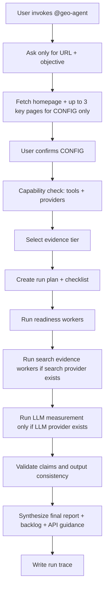

# GEO Agent Orchestration

`@geo-agent` is the only user-facing entry point for a complete GEO audit.

The user should not need to call worker agents manually. The orchestrator decides which workers run based on the confirmed objective, available providers, available tools, and the required evidence tier.

## Operating Principle

The correct order is:

1. Readiness
2. Measurement
3. Interpretation
4. Recommendations

The agent must not reverse this order. It must not recommend from results that do not exist.

## Strict Execution Flow



## Evidence Tiers

| Tier | Name | Can do | Cannot do |
|---|---|---|---|
| Tier 0 | Readiness | Crawlability, static files, schema presence, llms.txt, content readiness, entity clarity | Claim measured LLM visibility |
| Tier 1 | Search evidence | Everything in Tier 0 plus Serper/search-backed authority and competitor/source evidence | Claim measured LLM visibility |
| Tier 2 | LLM measurement | Everything above plus prompt execution through configured LLM providers or documented manual UI runs | Claim unrun providers as measured |
| Mixed | Combined evidence | Combine readiness, search, and measured rows | Upgrade weak evidence into measured claims |

## Worker Routing

| Objective | Workers that may run | Measurement rule |
|---|---|---|
| `quick-check` | geo-crawlers, geo-schema, geo-llms-txt | No LLM measurement |
| `crawlers` | geo-crawlers | No LLM measurement |
| `llms-txt` | geo-llms-txt | No LLM measurement |
| `schema` | geo-schema | No LLM measurement |
| `citability` | geo-citability | No LLM measurement |
| `brand-mentions` | geo-brand-mentions | Search evidence only unless monitor also runs |
| `llm-prompts` | geo-llm-prompts | Prompt library only |
| `monitor` | geo-llm-prompts, geo-monitor | Requires LLM provider or documented manual mode |
| `refresh` | selected prior workers, geo-monitor only if new provider runs exist | Use prior timestamps; do not freshen stale measurement |
| `full-audit` | all readiness workers, search worker if available, prompt worker, monitor if LLM provider available | Generate `07` every time; mark Not run if no provider |

## Worker Responsibilities

### geo-crawlers

Checks crawlability and technical access: status, robots.txt, AI crawler directives, sitemap discovery, static file availability, rendering risk, security headers, noindex/canonical concerns, and disallowed-route sanity.

### geo-llms-txt

Checks or drafts `llms.txt`. It treats the file as supplemental context, not a guaranteed visibility lever.

### geo-schema

Audits existing JSON-LD and proposes schema. It labels validation as `Validated`, `Reviewed only`, or `Not run`.

### geo-citability

Audits content for answer readiness: entity clarity, extractability, source support, proof, freshness, FAQ coverage, and quote-ready blocks.

### geo-brand-mentions

Collects external authority and brand/source evidence via Serper/search surfaces when available. It never reports LLM visibility.

### geo-llm-prompts

Instantiates the prompt library for the business. It produces a test plan, not results.

### geo-monitor

Runs measurement prompts only through configured LLM providers or documented manual UI runs. It writes measured rows only for providers actually run.

## User-Facing Checklist

After CONFIG confirmation and provider check, the orchestrator must show a checklist like this before running:

```md
I will run this audit in phases:

- [ ] Capability check - confirm available tools and APIs
- [ ] Readiness audit - crawlability, llms.txt, schema, content readiness
- [ ] Search evidence - only if Serper/search provider is configured
- [ ] LLM measurement - only if an LLM provider is configured
- [ ] Synthesis - prioritize fixes and create the report
- [ ] Consistency QA - make sure Run Plan, Results, Backlog, and Final Report agree
```

Before each phase, the orchestrator says:

- what it is about to run
- why it matters
- which worker/subskill it will use
- which output file it will update

After each phase, the orchestrator says:

- what ran
- what it found
- what was blocked or skipped
- what evidence status applies
- what should happen next
- which output file changed

## Prompt Library Use

The repo has 40 prompt definitions, but they are not all run for every objective.

| Prompt IDs | Phase | Runs when |
|---|---|---|
| 01-05 | Discovery | Full audit or onboarding expansion |
| 10-17 | Measurement | Only with configured LLM provider or documented manual UI mode |
| 20-25 | Extraction | Only after real LLM responses exist |
| 30-34 | Interpretation | Only from measured/search/observed evidence, clearly labeled |
| 40-48 | Audit | Readiness and content audit phases |
| 50-53 | Action | Synthesis and backlog creation |
| 60-61 | Learning | Only when historical/prior data exists |
| 90 | Validation | Before writing structured measurement rows |

## No-API Fallback Mode

If no APIs are configured, the agent still runs a useful Tier 0 readiness audit.

It can produce:

- technical readiness findings
- crawler and static-file findings
- llms.txt draft
- schema recommendations
- content citability/readiness findings
- prompt library for manual execution
- fix guide
- backlog
- final report
- API setup guide

It cannot produce measured LLM visibility. `07-LLM-VISIBILITY-RESULTS.md` must say:

`Status: Not run — no LLM provider configured`

## Serper-Only Mode

If only `SERPER_API_KEY` is configured, the agent may collect search-backed external authority and competitor/source evidence.

It still cannot claim measured LLM visibility.

Required language:

`Serper search evidence was collected, but this is not LLM visibility measurement.`

## LLM Provider Mode

If at least one LLM provider is configured, the monitor may run selected measurement prompts.

The provider must be named accurately:

- OpenAI API is not ChatGPT UI.
- Anthropic API is not necessarily Claude UI.
- Gemini API is not necessarily Gemini UI.
- Manual UI runs must be logged as manual UI.

## Output Consistency Rule

Before finishing, the orchestrator must verify:

- `01-RUN-PLAN.md` says the same phases ran as `11-RUN-TRACE.md`.
- `07-LLM-VISIBILITY-RESULTS.md` agrees with provider availability.
- `08-BACKLOG.md` does not treat unrun phases as measured.
- `09-FINAL-REPORT.md` separates readiness, measurement, and recommendations.
- OpenAI API results are not labeled ChatGPT UI.
- Serper/search evidence is not labeled measured LLM visibility.
